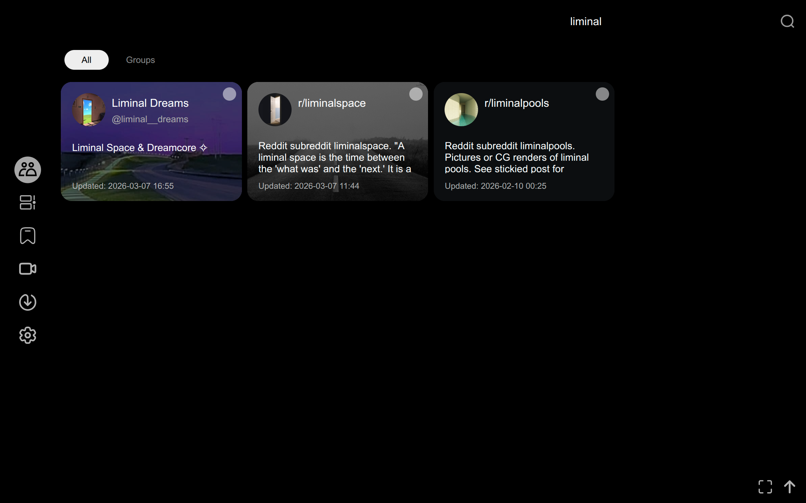
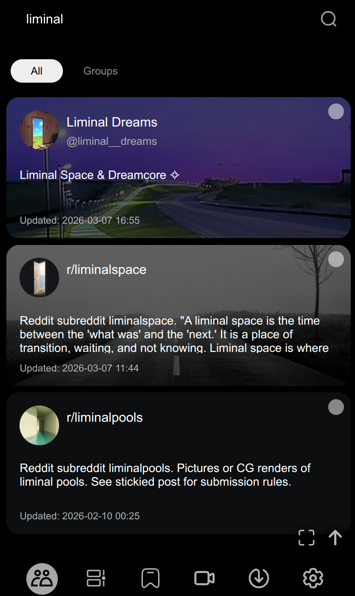
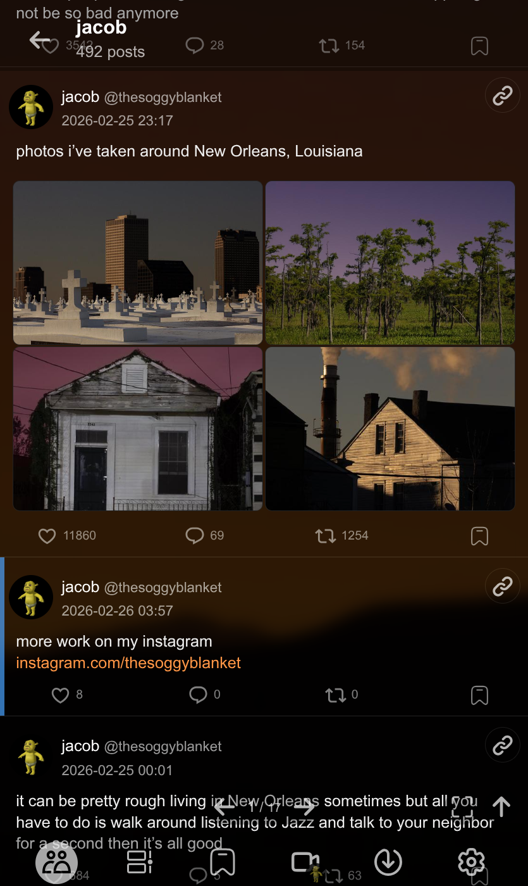
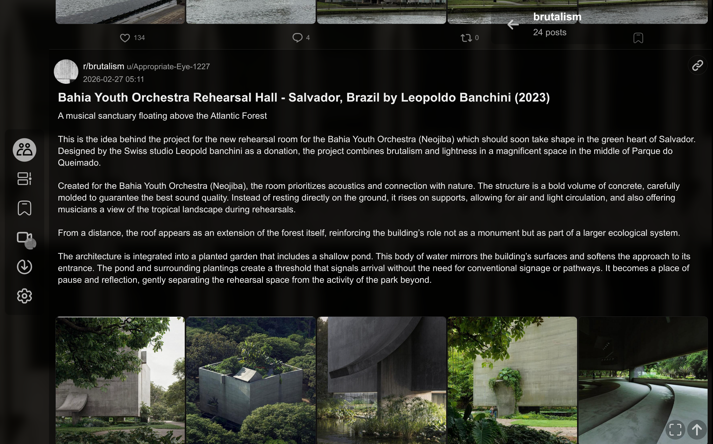
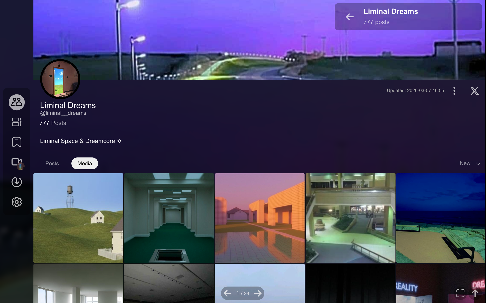
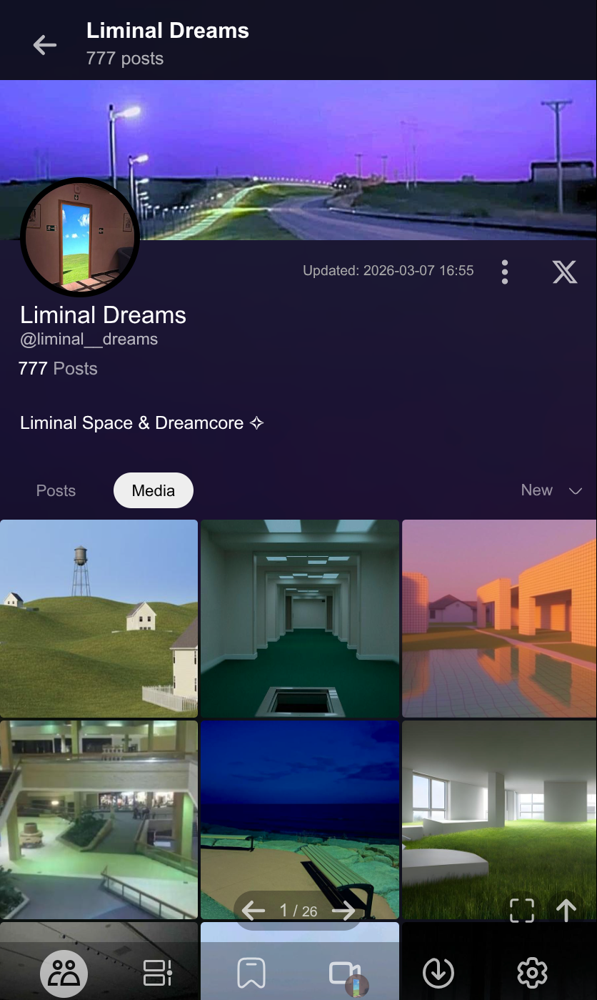
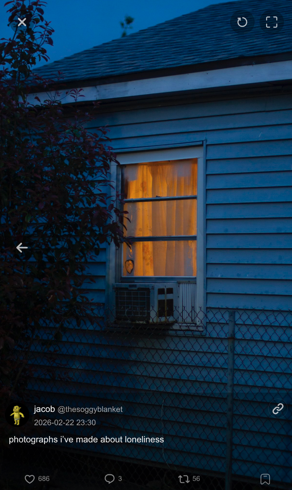
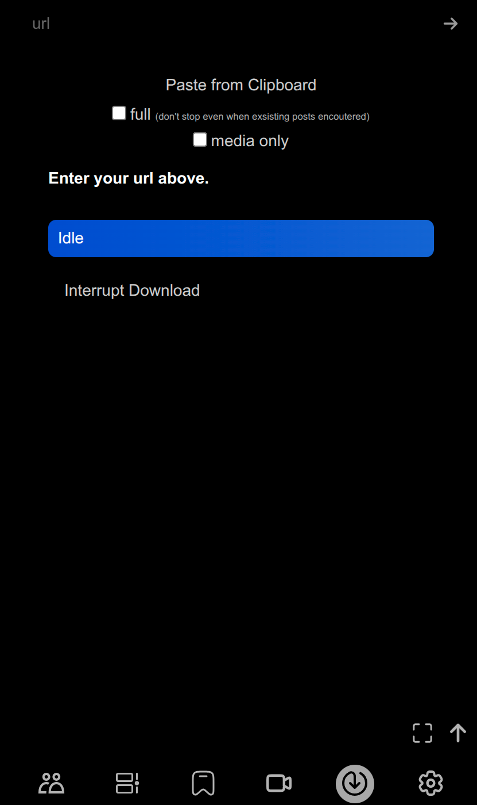
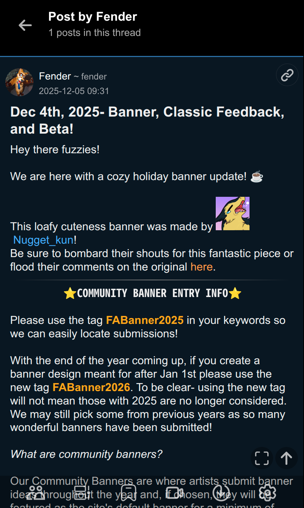
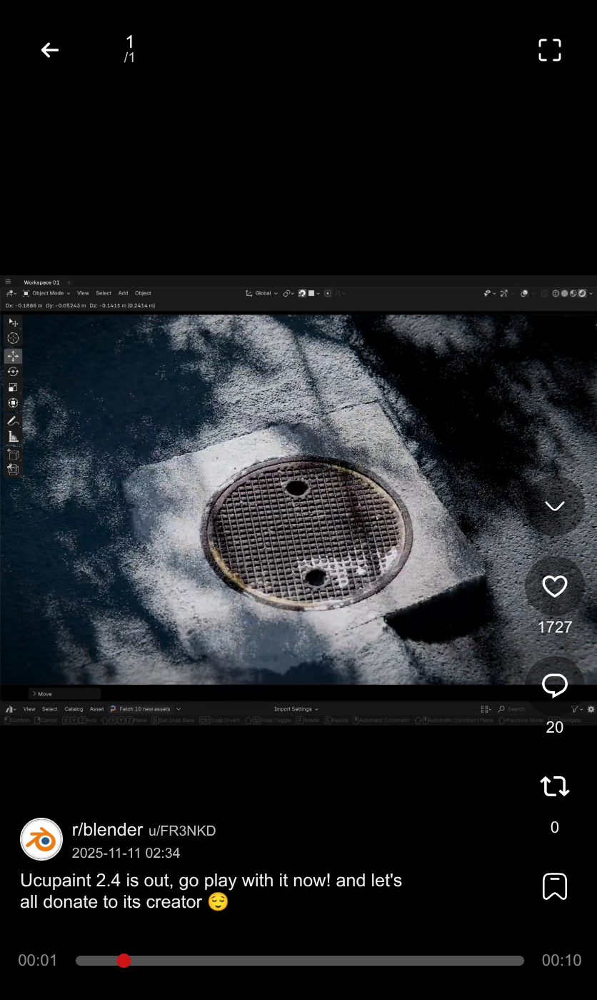

Downloader and viewer for x, bluesky, reddit and furaffinity. Uses [mikf/gallery-dl](https://github.com/mikf/gallery-dl) as downloader for x, bluesky and reddit, and a custom downloader for furaffinity.

<b>Still work in progress, expect breaking changes every few commits.</b>

## Launch

### 1. Install Dependecy

```
pip install -r requirements.txt
sudo apt install ffmpeg -y
```

### 2. Edit config file `config.json`.

### 3. Get your `x.com_cookies.txt` from browser extension.

### 4. Launch from cli.

`
python ./app.py
`

```
# python ./app.py -h

Using python interpreter: /home/user/venv/bin/python
usage: app.py [-h] [--debug] [--skip-scan] [--update-daemon] [-c CONFIG] [-v VERBOSE] [--monitor-timeline]

My Timeline - A personal social media archive and viewer.

options:
 -h, --help      show this help message and exit
 --debug        Include this option to enable debug mode.
 --skip-scan      Skip startup scan.
 --update-daemon    Regularly update, from oldest to recent updated users, DO NOT use if you have a large number of users or posts. Recommended to run once and then disable.
 -c, --config CONFIG  Path to config file. See example_config.jsonc for reference.
 -v, --verbose VERBOSE
            Verbose level for logging, 0-3.
 --monitor-timeline  Regularly monitor timelines for new posts and automatically download them. Recommended to run once and then disable. Bluesky only, and fill in 'bsky_auth.json' first.
```

### Or launch with Gunicorn
`gunicorn -c ./gunicorn.conf.py "app:wsgi_app(config_file='config.json')"`

## Screenshots

#### Userlist




#### Timeline and Media






#### Media Viewer, Download Page and Rich text rendering





#### ... and Doomscrolling

